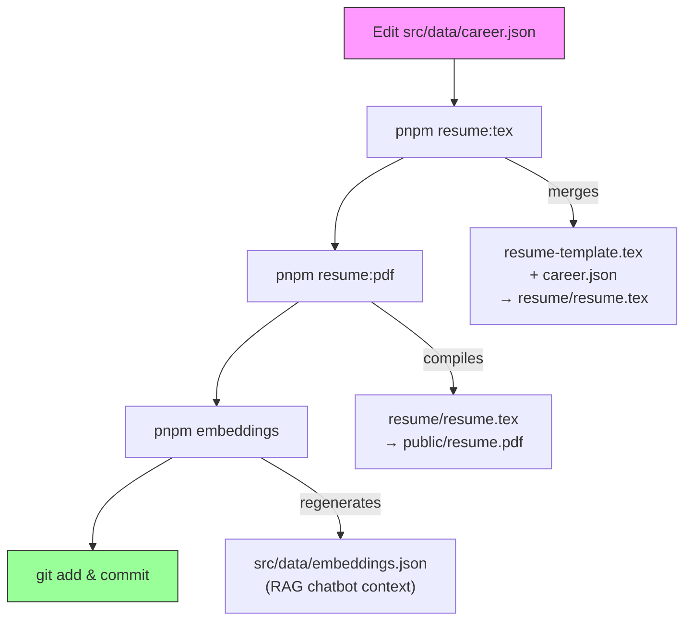

# Resume PDF Generation

This project generates `public/resume.pdf` from `resume/resume.tex`.

## Workflow: Updating Career Data

When you edit `src/data/career.json`, follow this pipeline to keep all generated artifacts in sync:



| Step | Command | What it does |
|------|---------|--------------|
| 1 | — | Edit `src/data/career.json` with new job titles, dates, or bullets |
| 2 | `pnpm resume:tex` | Merges `resume/resume-template.tex` (header, skills) with the EXPERIENCE section generated from `career.json` → writes `resume/resume.tex` |
| 3 | `pnpm resume:pdf` | Compiles `resume/resume.tex` into `public/resume.pdf` via pdflatex |
| 4 | `pnpm embeddings` | Regenerates `src/data/embeddings.json` so the RAG chatbot has up-to-date resume context (requires `GOOGLE_GENERATIVE_AI_API_KEY`) |
| 5 | — | Commit `career.json`, `resume.pdf`, and `embeddings.json` together (`resume.tex` is gitignored) |

> **Tip:** The pre-commit hook runs steps 2–4 automatically when you stage any embedding-source file. You can skip it with `git commit --no-verify` if the API key is unavailable.

## Prerequisites

1. Install a LaTeX distribution (smaller option):

```bash
brew install --cask basictex
```

2. Ensure the custom document class exists:

- `resume/resume.cls`

The resume template uses `\documentclass{resume}`, so `resume.cls` must be available.

## Generate Resume PDF

From repo root:

```bash
pnpm resume:pdf
```

The script now:

- Automatically prepends `/Library/TeX/texbin` to `PATH` when present.
- Automatically prepends `resume/` to `TEXINPUTS` so local `resume.cls` resolves.
- Writes output to `public/resume.pdf`.

## Troubleshooting

- `pdflatex is required`:
  - Confirm install: `/Library/TeX/texbin/pdflatex --version`
  - Re-run: `pnpm resume:pdf`
- `File 'resume.cls' not found`:
  - Confirm file exists at `resume/resume.cls`
  - Confirm permissions allow reads (`ls -l resume/resume.cls`)
